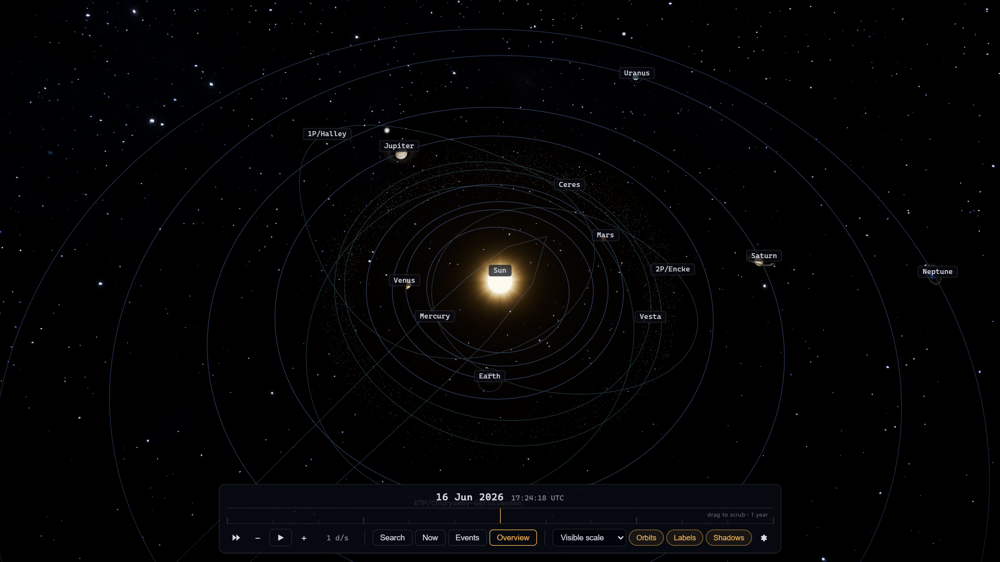
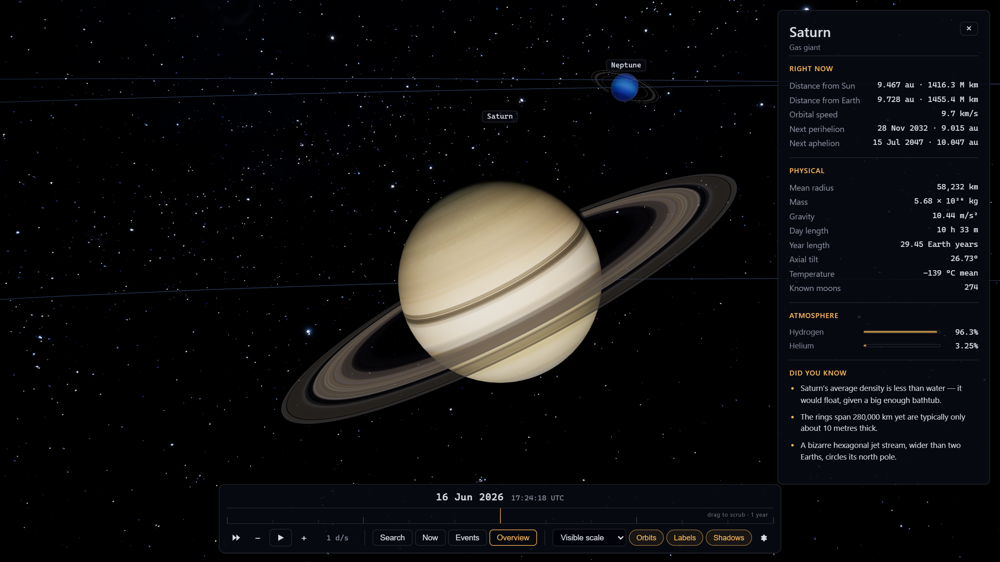
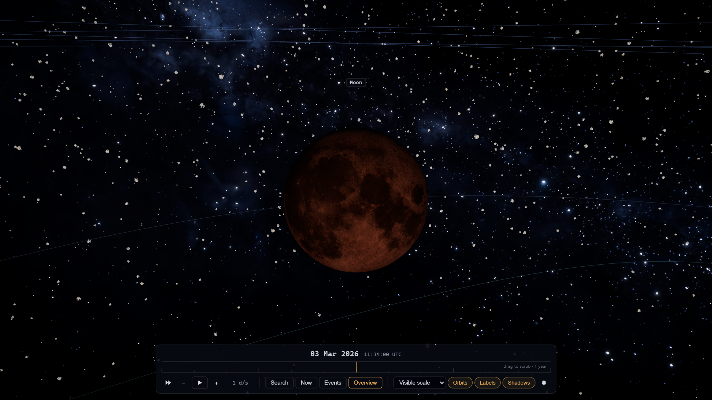
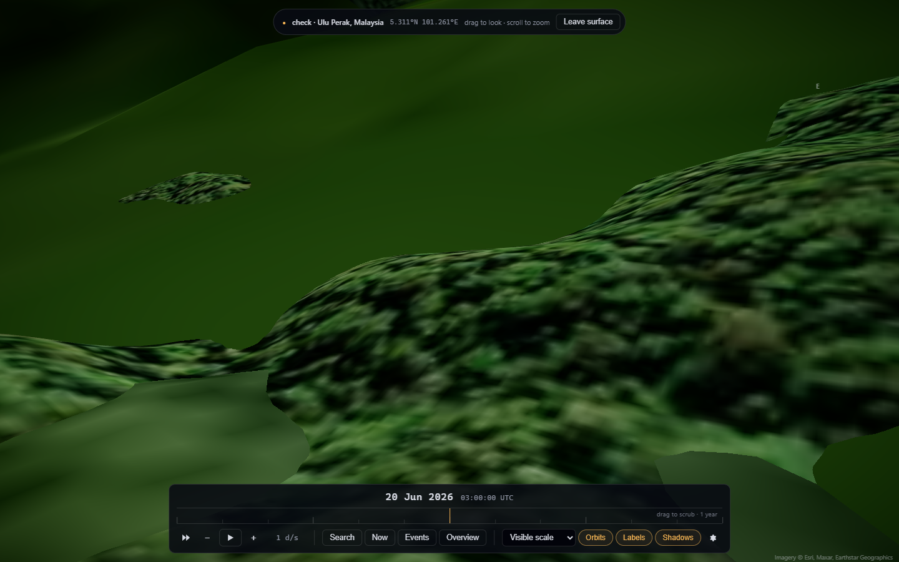

# Orrery — a real-time 3D solar system

A physically-grounded, real-time 3D simulation of the solar system you can fly
through, scrub through time, and even **stand on**. Planets, moons, rings, the
asteroid belt and active comets are placed by real ephemeris
(`astronomy-engine` + Kepler propagation), rendered with React Three Fiber and
custom GLSL, and driven by a double-precision, camera-relative pipeline so the
scene holds up from the whole solar system down to a hillside on Earth.



<table>
<tr>
<td width="50%"></td>
<td width="50%"></td>
</tr>
<tr>
<td width="50%"></td>
<td width="50%" valign="top">

**What you're looking at**

- **Saturn** with analytic ring shadows and a live facts panel.
- A **total lunar eclipse** (2026-03-03) — the Moon reddens as it crosses
  Earth's umbra, computed in-shader.
- **Surface mode**: stand at any point on Earth on real 3D terrain (AWS
  elevation draped with Esri imagery) and watch the sky from the ground.

</td>
</tr>
</table>

## Features

- **The whole system, moving for real.** All eight planets, the Moon, the four
  Galilean moons + Titan, Ceres and Vesta, and four comets — positioned by
  `astronomy-engine` and Keplerian propagation, with correct IAU rotation axes
  and tilts. A 20–32k-instance asteroid belt draws in a single call.
- **Time machine.** Scrub a draggable timeline, play forward/back at speeds up
  to years per second, or jump to "now". Everything — eclipses, seasons, comet
  tails, Saturn's ring tilt — follows.
- **Events.** A merged eclipse timeline (solar + lunar), meteor showers, and
  comet perihelia. Total solar eclipses cast a real umbra spot that crawls
  across Earth; total lunar eclipses turn the Moon blood-red. Jump to any event.
- **Stand on the surface.** Pick a city, a landmark (smallest country, the
  midnight-sun cape, the poles, Point Nemo…), or double-click the globe to drop
  to the ground and look up: a topocentric sky with the Sun and Moon at their
  true parallax-correct positions, so **solar eclipses literally happen on
  screen**, plus auroras (live NOAA Kp), meteor showers, and golden-hour
  atmosphere — over real 3D terrain.
- **Search everything.** `Ctrl/⌘ + K` fuzzy-searches bodies, eclipses, comet
  perihelia, showers, cities, and actions.
- **Quality presets** (Low→Ultra): pixel-ratio cap, belt density, comet-tail
  particle counts, and progressive 8K textures.
- **Polished + accessible.** Keyboard timeline scrubbing, ARIA roles, layered
  Escape, `prefers-reduced-motion` support, mobile gestures (two-finger time
  scrub), and responsive layout.

## Getting started

```bash
npm install
npm run dev
```

Then open the URL Vite prints (default <http://localhost:5173/>).

The planet/star textures live in `public/textures/` and are **committed to the
repo**, so a fresh clone is ready to run. (`node scripts/fetch-assets.mjs` can
re-download them from source if they're ever missing or you want to refresh
them; it's idempotent and skips files already present.) Source URLs and
licenses are in [ASSETS.md](ASSETS.md).

## Controls

| Action | Control |
| --- | --- |
| Orbit / pan / zoom | Drag · right-drag · scroll (one finger / pinch on touch) |
| Focus a body | Click its label, or search it |
| Open command palette | `Ctrl` / `⌘` + `K` (or `/`) |
| Scrub time | Drag the timeline, or arrow keys when it's focused (`Shift` = 30 d) |
| Scrub time (touch) | Two-finger horizontal drag |
| Stand on Earth | Double-click the globe · the Earth panel's "Stand on the surface" · a city in search · "Watch from ground" on an eclipse |
| Look around (surface) | Drag to look · scroll to zoom the field of view |
| Leave the surface / close a panel | `Esc` |

## How it's built

- **Double precision, camera-relative.** Body positions are kept as
  double-precision kilometres and rebased to a floating origin each frame, then
  rendered in camera-relative float32 with a logarithmic depth buffer — so there
  are no jitter or z-fighting artifacts across the enormous dynamic range (from
  Neptune's orbit to a 40 m eye height on a hillside).
- **Ephemeris is the source of truth.** `src/ephemeris/` wraps `astronomy-engine`
  (J2000 ecliptic) and a custom Kepler solver; the unit tests pin values against
  JPL Horizons / SBDB, including the 2026-08-12 total solar eclipse and the
  2061 Halley apparition.
- **Analytic shaders.** Terminators, limb darkening, ring shadows, the eclipse
  umbra, ocean glint and the atmosphere are computed in GLSL
  (`src/shaders/`, `vite-plugin-glsl`) rather than faked with lights.
- **Topocentric surface mode.** One quaternion reorients the existing ecliptic
  scene into a local east/north/up frame, so the orbit conventions are reused
  unchanged on the ground; terrain is real AWS Terrarium elevation (bilinearly
  sampled) draped with Esri World Imagery.
- **Ship-ready front end.** Route-level code splitting (the surface subtree is
  lazy-loaded and prefetched), a stable vendor chunk for cache longevity,
  render-error boundaries that recover gracefully (a broken surface drops back
  to orbit instead of blanking the app), and progressive textures (2K now, 8K
  in the background).

## Scripts

| Command | What it does |
| --- | --- |
| `npm run dev` | Start the Vite dev server with HMR |
| `npm run build` | Type-check (`tsc -b`) and produce a production build |
| `npm run preview` | Serve the production build locally |
| `npm test` | Run the Vitest unit tests |
| `npm run lint` | Run ESLint |
| `npm run format` | Format `src/` with Prettier |

The `scripts/dev-*.mjs` files are headless (Playwright) verification harnesses —
each focuses a slice of the app, asserts behaviour via the `window.__orrery`
dev hooks, and saves screenshots to `scripts/tour/`.

## Tech stack

Vite · React 19 · TypeScript (strict) · `@react-three/fiber` · `drei` ·
`@react-three/postprocessing` · `three` · `zustand` · `astronomy-engine` ·
Vitest. GLSL shaders via `vite-plugin-glsl`.

## Deployment

Deployed to **GitHub Pages** via [`.github/workflows/deploy.yml`](.github/workflows/deploy.yml):
on every push to `main` it builds with the project-page base (`/Orrery/`) and
publishes. One-time setup: in the repo's **Settings → Pages**, set **Source** to
**GitHub Actions**.

The app is a plain static SPA, so any static host works too (Vercel, Netlify,
Cloudflare Pages) — just `npm run build` and serve `dist/`. Runtime asset URLs
go through `src/utils/asset.ts` so they resolve correctly under any base path.

## Credits & licenses

- Planet, moon and star textures: **Solar System Scope** (CC BY 4.0). Full
  manifest and source URLs in [ASSETS.md](ASSETS.md).
- Surface imagery: **Esri World Imagery** (© Esri, Maxar, Earthstar
  Geographics) — attributed in the surface HUD as required.
- Surface elevation: **AWS Terrarium / Mapzen** terrain tiles.
- Space-weather (aurora) data: **NOAA SWPC** planetary Kp.
- Reverse geocoding: **BigDataCloud** client API.
- Ephemeris: **`astronomy-engine`**; reference values from **JPL Horizons / SBDB**.

## Comet note

Comet tails scale with distance from the Sun: a comet is dormant beyond ~4.6 au
and dramatic near perihelion. If a comet looks "tailless," scrub the timeline
toward its perihelion — that's physics, not a bug.
